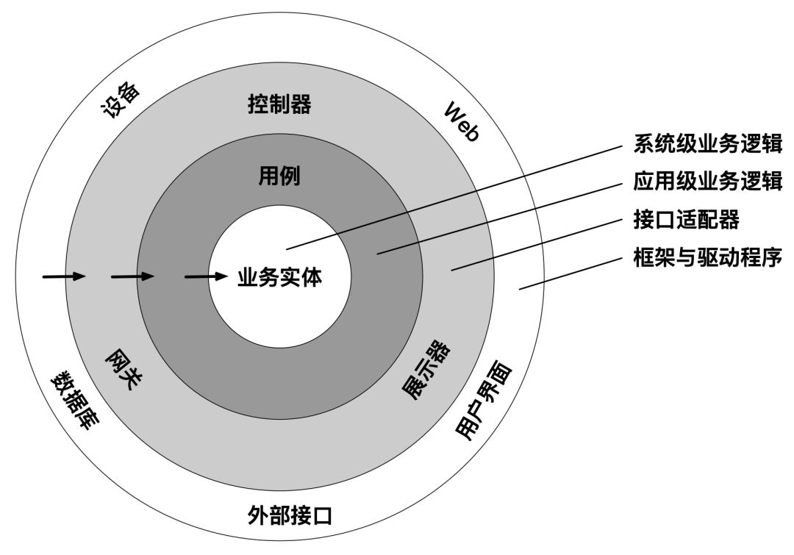

### 整洁架构

#### 第2部分 编程范式
* [架构整洁之道 3~6章读书笔记](https://cloud.tencent.com/developer/article/1834412)
* [架构整洁之道-03 编程范式-函数式编程](https://juejin.cn/post/7027679199326371854)
* [如何评价 Bob 大叔的新书《架构整洁之道》](https://www.zhihu.com/question/301498382/answer/1018334384)
* [架构整洁之道, 看这一篇就够了](https://mp.weixin.qq.com/s/Kd1T40KZWvdThKC3IN6n-Q)
* 编程范式不是为程序员提供了更多的能力，而是限制了能力：
  * 结构化编程限制了控制权的直接转移；
  * 面向对象编程限制了控制权的间接转移；
  * 函数式编程限制了赋值；

所谓限制控制权的直接转移，即是限制了goto语句的使用。要求用顺序结构、分支结构、循环结构这三种结构构造出任何程序。好处是方便把大项目拆分成一个个可证伪的组件。

所谓限制控制权的间接转移，即是限制了函数指针的使用。指针的使用，就是代码在原来的流程里不继续执行了，转而去执行别的代码，但具体执行了啥代码你也不知道，你只调了个函数指针或者接口。相对于goto的直接转移，这叫做控制权的间接转移。面向对象编程对于架构的启发最大在于：多态。这使得跨越组件编程变得更安全，同时也是依赖倒置的基础。

函数式编程中的变量不再改变。我们的所有并发程序（多核多线程）的问题，如果没有可变变量，就不再出现了。当然，这是不可能的，我们可以通过将需要修改状态的部分和不需要修改的部分分隔成单独的组件，在不需要修改状态的组件中使用函数式编程，提高系统的稳定性和效率。

#### 第3部分 设计原则
* 单一职责SRP（Single Responsibility Principle）；
  * 一个模块有且只能对一个角色负责，不是每个模块都只做一件事。
  * 例如一个类既被CTO又被COO调用，COO提出修改需求导致CTO的调用出现bug
* 开闭原则OCP（Open Closed Principle）；
  * 对扩展开放，对修改关闭
* 里氏替换LSP（Liskov Substitution Principle）；
  * 父类出现的地方可以用子类进行替换。具体到架构层面，它指导的是接口与其实现方式。
* 接口隔离ISP（Interface Segregation Principle）；
  * 不依赖任何不需要的方法、类或组件
* 依赖反转DIP（Dependency Inversion Principle）；
  * 组件之间，接口放在边界的哪边，依赖就指向哪边。

#### 第4部分 组件构建原则
* 组件的聚合原则
  * 复用发布原则(REP)：只要复用一段代码就把它抽成组件。如何抽组件，需要依据共同封闭原则、共同复用原则。
  * 共同封闭原则(CCP)：为了相同目的而同时修改的类，应该放在同一个组件中。共同封闭原则是组件视角下的单一职责原则。
  * 共同复用原则(CRP)：不要强迫一个组件依赖它不需要的东西。共同复用原则是组件视觉下的接口隔离原则。
* 组件依赖原则
  * 无循环依赖原则：如果有循环依赖，那么会导致无关组件一起发布，一起部署。
    * 如何处理循环依赖，可以使用依赖倒置原则，解除循环依赖。
  * 稳定依赖原则：组件应该依赖比它更稳定的依赖
    * 不稳定性 = 出向依赖数量 / (入向依赖数量 + 出向依赖数量)
    * 出向依赖指自己依赖外部，入向依赖指外部依赖自己
  * 稳定抽象原则：越抽象，越稳定
    * 抽象程度 = 组件中抽象类和接口的数量 / 组件中类的数量
    
<table>
    <tr>
        <th>类型</th>
        <th>范式/原则</th>
        <th>对类/架构的意义</th>  
    </tr>
    <tr>
        <td rowspan="3">编程范式 (如何组织代码)</td>
        <td>结构化编程</td>
        <td>拆分不同的函数、模块、组件</td>
    </tr>
    <tr>
        <td>面向对象编程</td>
        <td>依赖倒置基础</td>
    </tr>
    <tr>
        <td>函数式编程</td>
        <td>拆分可变和不可变</td>
    </tr>
    <tr>
        <td rowspan="5">设计原则 (如何组织类)</td>
        <td>单一职责</td>
        <td>分隔不同角色依赖的代码</td>
    </tr>
    <tr>
        <td>开闭原则</td>
        <td>指导整体的类设计</td>
    </tr>
    <tr>
        <td>里氏替换</td>
        <td>指导接口和实现方式</td>
    </tr>
    <tr>
        <td>接口隔离</td>
        <td>指导接口设计</td>
    </tr>
    <tr>
        <td>依赖反转</td>
        <td>指导组件间依赖的方向</td>
    </tr>
    <tr>
        <td rowspan="3">组件聚合原则 (类归入哪些模块)</td>
        <td>复用发布原则=开闭原则</td>
        <td rowspan="3">指导组件拆分的粒度</td>
    </tr>
    <tr>
        <td>共同封闭原则=单一职责</td>
    </tr>
    <tr>
        <td>共同复用原则=接口隔离</td>
    </tr>
    <tr>
        <td rowspan="3">组件依赖原则 (模块相互依赖)</td>
        <td>无循环依赖原则</td>
        <td>指导分层</td>
    </tr>
    <tr>
        <td>稳定依赖原则</td>
        <td>指导分层</td>
    </tr>
    <tr>
        <td>依赖抽象原则</td>
        <td>有利于组件扩展</td>
    </tr>
</table>

#### 第5部分 软件架构
* 什么是组件？组件是一组描述如何将输入转化为输出的策略语句的集合，在同一个组件中，策略的变更原因、时间、层次相同。
* 架构工作有两个方针：
  * 尽可能长时间地保留尽可能多的可选项(可选项指的是无关紧要的细节设计)
  * 不完全边界能解决的，不要用完全边界；低层次解耦能解决的，不要用高层次解耦。
* 拆分维度：
  * 变更原因拆分，例如拆分为：订单组件、结算组件、商品组件
  * 层次拆分，例如拆分为：业务实体、用例、接口适配器、框架与驱动程序
    * 把数据作为系统的核心（传统分层架构）
    * 把业务实体作为系统的核心（洋葱架构、DDD架构、六边形架构、干净架构等）
  * 按照读写拆分，演化出了CRQS架构
  * 按照组件是否集中治理，演化出微服务架构、SOA架构

上图有四个分层：业务实体、用例、接口适配器、框架与驱动程序。其中距离系统的输入输出越远，它的层次越高，所以业务实体是最高的层。

`不完全边界能解决的，不要用完全边界；低层次解耦能解决的，不要用高层次解耦。`

* 完全边界包括哪些内容？首先跨越组件边界进行通信的两个类都要抽象为接口，另外需要声明专用的输入输出数据模型，想一想每次进行通信时都要进行的数据模型转换，就能理解维护一个组件边界的成本有多高。
* 不完全边界有三种方式：
  * 省掉最后一步：声明好接口，做好分割后，仍然放在一个组件中，等到时机成熟时再拆出来独立编译部署。
  * 单向边界：正常的边际至少有两个接口，分别抽象调用方和被调用方。这里只定义一个接口，高层次组件用接口调用低层次组件，而低层次组件直接引用高层次组件的类。
  * 门户模式：控制权的间接转移不用接口和实现去做，而是用门户类去做，用这种方式连接口都不用声明了。
* 尽量用低层次解耦（成本最低），而层次从低到高依次是：
  * 源码层次：做了接口、类依赖上的解耦，但是放在同一个组件中，通常放在不同的路径下。和不完全边界的省略最后一步一样。
  * 部署层次：拆分为可以独立部署的不同组件，比如iOS的静态库、动态库，真正运行时处于同一台物理机器上，组件之间通常通过函数调用通讯。
  * 服务层次：运行在不同的机器上，通过网络数据包进行通讯。

