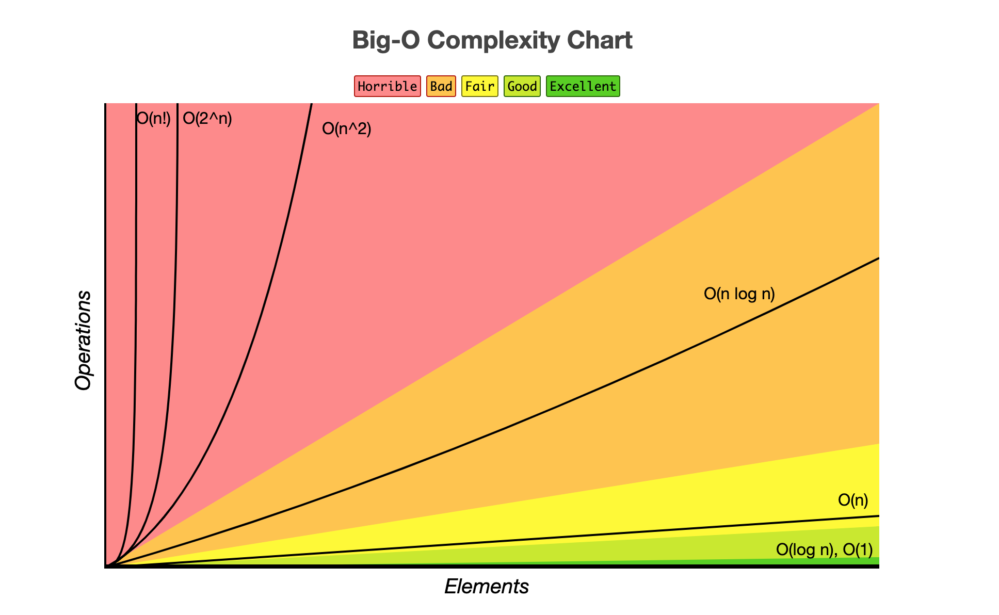

### 数据结构、数组排序、堆操作

#### 资料
1. [计算机科学常见算法复杂度](http://byteliu.com/2020/05/14/%E8%AE%A1%E7%AE%97%E6%9C%BA%E7%A7%91%E5%AD%A6%E5%B8%B8%E8%A7%81%E7%AE%97%E6%B3%95%E5%A4%8D%E6%9D%82%E5%BA%A6/)

#### 数据结构

#### 数据排序

#### 堆操作

#### 大O复杂度

  