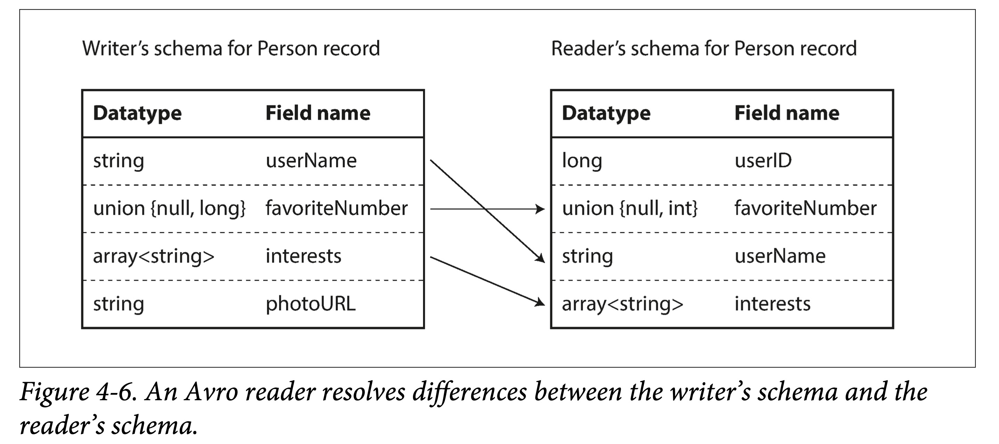

### Designing Data-Intensive Application

#### 参考资料
* [我读 DDIA](https://mp.weixin.qq.com/s/prB6R3Awu252D3czbnZUkQ)

#### 第1章 可靠、可扩展与可维护的应用系统
* 设计数据系统会碰到的问题：
  * 如何确保数据的正确性和完整性？
  * 系统降级时如何提供一致的良好表现？
  * 负载增加时系统如何扩展？
  * 友好的服务API如何设计？
* 可靠性：安全的正确的执行，即使发生了某些错误也能正确运行
  * 硬件故障：硬盘崩溃、内存故障、电网停电、网线断了等等
  * 软件错误：特定输入导致的错误；CPU内存资源用尽；依赖的服务出现异常；
  * 人为失误：以最小出错的方式设计系统
* 可扩展性：垂直扩展和水平扩展
* 可维护性：三个设计原则
  * 可运维性，良好的可操作性使工作变得简单，从而关注于高附加值的任务
    * 提供系统运行时的可观测性
    * 支持自动化，与标准工具集成
    * 避免绑定特定机器，允许机器停机维护
    * 良好的文档和易于理解的操作模式
  * 简单性
    * 复杂性的表现：状态空间的膨胀；模块紧耦合；不一致的命名和术语；引入特殊框架
    * 复杂性使得维护系统变得越来越困难，预算超支和进度滞后
    * 好的设计抽象可以隐藏大量的设计细节，对外提供干净易懂的接口
  * 可演化性：目标是可以轻松的修改数据系统，使其适应不断变化的需求
  
#### 第2章 数据模型与查询语言
* 常见的三种数据模型：关系数据库、文档数据库、图数据库
* 关系数据库和文档数据库：
  * 前者可以处理多对一和多对多，后者则不太方便
  * 后者处理一对多效率高，前者则需要联接查询
* 文档数据库和图数据库
  * 前者预期数据都来着同一文档，文档与其他文档的关联很少
  * 后者则相反，预期所有的数据都可能互相关联
  * 两者的共同点：不会对存储的数据强加一个模式，使得应用程序易于应对变化的需求
  
#### 第3章 数据存储与检索
* [DDIA逐章精度小册学习【第三章】](https://juejin.cn/post/7191125304285331516)
* CSV：123456,{"name":"a"}\n42,{"name":"b"}
* Bitcask：在CSV的基础上，用内存存储hash索引：{123456:0, 42:20}；数据分段存储，老数据段压缩
* Bitcask的缺点：
  * hash索引很大，内存放不下，放硬盘性能又跟不上
  * 不支持范围查询
* SSTable：每个段的key在该段是唯一且已排序
  * 写入时先写入内存中的红黑树，达到阈值就写入磁盘
  * 内存索引记录每个段的开始key和结束key。查找某个Key时，去所有包含该Key的区间对应的文件二分查找即可。
  * 记录log用于机器崩溃后恢复内存表
* LSM-Tree：基于SSTable的优化
  * 优化SSTable的key的查找：使用布隆过滤器
  * 层级化组织SSTable：策略有大小分级和分层压缩
* B-tree：与LSM-Tree一样，它也支持高效的点查和范围查。
* TP(Transaction Processing)：事务处理
* AP(Analytical Processing)：分析处理
  * 数据仓库：与TP单独分开的数据库
  * 数据模型有星状模型、雪花模型
* 列存储：分析的SQL有时扫描数十亿行，但只关注几个列。如果按行存储则需要读取所有无关的列
* 列压缩：
  * product_sk列的原始数据是：69,69,31,29
  * 位图编码：需要三个位图
    * 69位图存储：1,1,0,0
    * 31位图存储：0,0,1,0
    * 29位图存储：0,0,0,1
  * 游程编码：需要三个游程
    * 69游程存储：0,2 // 两个1，后面都是0
    * 31游程存储：2,1 // 两个0，一个1
    * 29游程存储：3,1 // 三个0，一个1
* 列存储的写入：需要更新当前列，其他列为了保持下标对应，也需要更新

#### 第4章 数据编码与演化
* 向后兼容：当前PB协议可以读取老版本的pb二进制
* 向前兼容：当前PB协议可以读取新版本的pb二进制
* XML：字段类型只能是字符串
* JSON：字段类型只分字符串和数值，但是没有进一步区分数值类型
* Thrift和ProtoBuf都是二进制编码
  * Thrift有数组字段；ProtoBuf的数组是repeated，好处是optional字段可以改成repeated字段
  * 向后兼容：新加的字段必须是optional
  * 向前兼容：只能新加字段，不能删除和修改之前的字段(可修改相容的数据类型)
* Thrift和ProtoBuf修改相容的数据类型：int32改成int64
* Avro没有使用字段标号，Client-Server在通信的握手阶段会先交换数据模式
  * 相比Thrift和ProtoBuf，二进制数据不存储字段标号和字段类型，体积稍小
  * 向后兼容：新代码读取旧数据，首先得到旧数据的写入模式，与当前模式映射，再解读数据
  * 向前兼容：原理同上
  * 映射规则：使用字段名来进行匹配；忽略多出的字段；对缺失字段填默认值
  * 模式演化：只能添加或删除具有默认值的字段；只能修改Avro支持转换的类型



* Avro如何从编码中获取写入模式：
  * 如果一个大文件所有记录都使用相同模式编码，则在文件头包含一次写入模式即可。
  * 数据库在编码时额外记录一个模式版本号，通过版本去查询对应的写入模式即可。
  * 网络通讯时在一个session开始时交换模式，然后在整个session生命周期内都用此模式。
* Avro可以动态解析数据；Thrift和ProtoBuf需要先基于IDL生成代码(好处是可以做代码静态检查)
* 经由数据库的数据流：
  * 问题：新加了一个字段X，新版本进程把字段X设置为8，旧版本进程不能识别字段X而把值覆盖为空
  * alter table时不允许增加既没有默认值、也不允许为空的列。
* 经由服务的数据流：RESTful和RPC
  * RESTful使用JSON，比较容易添加新的字段来进行演进和兼容；RPC根据编码格式的兼容性规则进行演变；
  * RESTful常将将版本号做到HTTP请求头中；RPC一般提供客户端SDK，升级比较麻烦
* 经由消息传递的数据流
  * 如果消费者暂时不可用，可以充当暂存系统。
  * 当消费者宕机重启后，自动地重新发送消息。
  * 生产者不必知道消费者 IP 和端口。
  * 能将一条消息发送给多个消费者。
  * 将生产者和消费者解耦。

#### 第5章 数据复制
* 数据冗余的好处：
  * 降低延迟：可以在地理上同时接近不同地区的用户。
  * 提高可用性：当系统部分故障时仍然能够正常提供服务。
  * 提高读吞吐：可以水平扩展。
* 常用的冗余控制算法有：
  * 单领导者（single leader）
  * 多领导者（multi-leader）
  * 无领导者（leaderless）
* 数据库冗余问题在学术界不是一个新问题了，但在工业界，大部分人都是新手

##### 单领导者（single leader）
* 新增副本
  * 主副本在本地做一致性快照。
  * 将快照复制到从副本节点。
  * 从副本应用快照，并请求快照点之后的变更日志。
  * 当从副本赶上主副本进度后，就可以正常跟随主副本了。
* 从副本宕机：追赶恢复
  * 落后的多就拉取快照+日志；落后的少就拉取缺失日志。
* 主副本宕机：故障转移的步骤
  * 确认主副本故障。
  * 选择新的主副本。选择数据尽可能新的从副本
  * 让系统感知新主副本。
* 主副本宕机：会遇到的问题
  * 新老主副本数据冲突。新主副本没有同步完所有的日志，老主副本重新上线
  * 新老主副本角色冲突。老主副本重新上线后认为它才是主副本，既发生脑裂
  * 超时阈值选取。过小可能会发生主从频繁切换；过大则使得服务器长时间不可用
* 日志复制：基于语句的复制
  * 非确定性函数问题：NOW()、RAND()
  * 使用自增列，或依赖于现有数据。不同的执行顺序导致副本不一致。
  * 有副作用（触发器、存储过程、自定义函数）的语句
* 日志复制：传输预写日志（WAL）
  * 因为WAL日志和存储引擎绑定，需要注意版本升级的兼容性问题
* 日志复制：逻辑日志复制，与存储引擎无关（例如MySQL的binlog）
  * 对于插入行：日志需包含所有列值。
  * 对于删除行：日志需要包含待删除行标识，如主键
  * 对于更新行：要更新的列值
* 日志复制：基于触发器的复制
  * 由应用层来决策，性能较差且更易出错；但是给了用户更多的灵活性。

##### 复制滞后问题
* 读你所写：刚insert到主副本就去读从副本，但是从副本还没有数据
  * 按内容分类。读自己的资料时，从主副本读取；但读其他人资料时，可以向从副本读。
  * 按时间分类。近期内有过改动的数据，从主副本读，其他的，向从副本读。
  * 利用时间戳。查询时带上上次insert返回的时间戳，从同步时间大于此时间戳的副本读
* 单调读：读取副本A时能查询到记录，读取副本B时查不到
  * 只从一个副本读数据。
  * 利用时间戳。同上
* 一致前缀读：分区1先后记录A和B，分区2先后记录B和A
  * 不分区。
  * 让所有有因果关系的事件路由到一个分区。
* 副本滞后的终极解决方案：分布式事务

##### 多领导者（multi-leader）
* 单个数据中心，多主模型意义不大。适合多主模型的有：
  * 数据库横跨多个数据中心。可以就近写入
  * 需要离线工作的客户端
  * 协同编辑
* 处理写入冲突：冲突避免：
  * 例如根据用户的地理位置来分配主副本
  * 挑战1：用户从一个地点迁移到另一个地点
  * 挑战2：数据中心损坏，导致路由变化
* 处理写入冲突：冲突收敛
  * 给每个写入一个序号，并且后者胜。序号由外部系统生成
  * 例如在Wiki的冲突中，合并后的标题为“B/C”
  * 出现冲突时调用用户自定义的解决冲突策略的代码
* 处理写入冲突：界定冲突
  * 有些冲突显而易见：并发写同一个Key。
  * 有些冲突则更隐晦：例如预定一个会议室，用户A和用户B预定的时间有重叠。
* 三种复制拓扑：
  * 环形拓扑。如果一个节点故障，则可能中断复制链路。
  * 星型拓扑。中心节点负责接受并转发数据。如果中心节点故障，则会使得整个拓扑瘫痪。
  * 全连接拓扑。每个主库都要把数据发给剩余主库。通信链路冗余度较高，能较好的容错。
    * 需要用版本向量的策略，对多个副本的事件进行排序，解决因果一致性问题。

##### 无领导者（leaderless）
* 读时修复和反熵过程
  * 读时修复：在读取时发现旧的就顺手修了
  * 反熵过程：后台进程持续进行扫描，寻找陈旧数据然后更新
* Quorum读写：w+r>n可以保证读请求至少读到一个最新副本，n表示n个全量的副本
* quorum一致性的局限
  * 对于写写并发，如果处理冲突不当时。比如使用last-win策略，根据本地时间戳挑选时，可能由于时钟偏差造成数据丢失。
  * 对于读写并发，写操作仅在部分节点成功就被读取，此时不能确定应当返回新值还是旧值。
  * 如果写入节点数<w导致写入失败，但并没有对数据进行回滚时，客户端读取时，仍然会读到旧的数据。
  * 虽然写入时，成功节点数=w，但中间有故障造成了一些副本宕机，导致成功副本数<w，则在读取时可能会出现问题。

```
# 放松的Quorum和提示转交
Dynamo实际上不需要系统保障所有的quorum节点可用。它使用一种“sloppy quorum”的策略。
简单来说，一份数据储存在ABC三个节点中。当A节点宕机或不可达时，就临时储存在D节点中。
D节点单独有一块区域存储这些本不属于自己的数据，并进行定时轮询。如果发现A节点可用，就将数据传输回去并删掉本地的副本。始终保持三个节点的数据副本。
（注意此处选择D不是任意的，应该是在环中最近一个健康节点，这样才能保证故障时读写数据能找到该节点）。

# 解决写写并发有两个方案
# 1.后者胜（Last-Write-Win）
后者胜（LWW，Last-Write-Win）的策略是，通过某种手段确定一种全局唯一的顺序，然后让后面的修改覆盖之前的修改。
如，为所有写入附加一个全局时间戳，如果对于某个key的写入有冲突，可以挑选具有最大时间戳的数据保留，并丢弃较早时间戳的写入。
LWW有不可重复读问题，客户端写入数据后迅速再读，会发现不是自己写入的数据。

# 2.单副本确定Happens-Before
服务器为每个键分配一个版本号V，每次该键有写入时，将V+1，并将版本号与写入的值一块保存。
当客户端读取该键时，服务器将返回所有未被覆盖的值以及最新的版本号。
客户端在进行下次写入时，必须包含之前读到的版本号Vx（说明基于哪个版本进行新的写入），并将读取的值合并到一块。
当服务器收到特定版本号Vx的写入时，可以用其值覆盖所有V≤Vx的值。

# 多副本确定Happens-Before：版本向量
```


#### 第6章 数据分区
* 分片(分区)，Partition，有很多别称。通用的有Shard；具体到实际系统，HBase 中叫Region，BigTable中叫tablet
* 通常在分布式数据库中会有三级划分：数据集(如Database、Bucket)——分片(Partition)——数据条目(Row、KV)
* 分片时有一些基本要求
  * 分片过程中要保证数据均匀，否则会有数据偏斜产生数据热点。
  * 分片后需要保存路由信息，给一个KV条目，能知道去哪个机器上去查；稍差一些可以知道去哪几个机器上去找。
* 按键范围（Key Range）分区
  * 优点：可快速的范围查询。如以时间戳为key，可获取一段时间内数据
  * 缺点：数据分散不均匀，且容易造成热点。以时间戳为key，可能最新写入都被路由到最后一个分区节点
* 按键散列（Hash）分区
  * 优缺点与范围分区相反
  * 需要用元数据存储逻辑分片到物理节点的映射，如果使用一致性哈希，可实现半自动的增量式迁移
* 两种分区方式的小结
  * 区别1：一个使用应用相关值（Key）分区，一个使用应用无关值（Hash(key)）分区
  * 区别2：前者支持高效范围查询，后者可以均摊负载。
  * 使用多个字段，组合使用两种方式，使用一个字段进行分区，使用另一个字段在分区内进行排序，兼取两者优点。
* 负载偏斜和热点消除
  * 负载偏斜：如微博大V其发布的一条tweet，引起大量的comment，comment表以tweet_id哈希到同一个节点
  * 热点消除：给tweet_id拼接0~99的随机数，最多分散到100个节点。（读取时需要进行结果合并）
  * PS：最好能自动检测热点，自动拆分合并分区，以消除倾斜和热点。
* 次级索引：用户表(user_id,name)的主索引是user_id，有时候需要基于name建次级索引
* 次级索引-本地索引：
  * 优点：更新数据时，只需要在该分区所在机器同时更新索引即可。
  * 缺点：查询效率相对较低，所有基于索引的查询请求，都要发送到所有分区，并将结果合并。
* 次级索引-全局索引：
  * 能避免索引查询时的scatter/gather操作，但维护起来较为复杂，因为每个数据的插入，可能会影响多个次级索引
  * 全局索引多为异步更新。但由此会带来短暂（有时可能会比较长）的数据和索引不一致。
  * 为了保证强一致性，需要引入跨分区的分布式事务（实现复杂度高，且会带来较大的性能损耗）
* 分片均衡-rebalancing
  * 均衡后负载（存储、读写）在节点间均匀分布
  * 均衡时不能禁止读写，并且尽量减小影响
  * 尽量减少不必要的数据移动，尽量降低网络和磁盘IO
* 分片均衡-动态分区
  * 范围分区的方案，存在数据不均匀的情况，因此可以才有动态分区的方法
  * 开始，数据量很少，只有一个分区。
  * 随着数据量不断增长，单个分区超过一定上界，则按尺寸一分为二，变成两个新的分区。
  * 如果某个分区，数据删除过多，少于某个下界，则会和相邻分区合并。
* 分片均衡-静态分区
  * 逻辑分区的数量是固定的，需要维护逻辑分区到物理节点的映射
* 请求路由的方案
  * 每个节点都有全局路由表。客户端可以连接集群中任意一个节点
  * 由一个专门的路由层来记录。客户端所有请求都打到路由层
  * 让客户端感知分区到节点映射。客户端根据路由信息直接请求节点

#### 第7章 事务
* [步步为营 剖析事务中最难的——隔离性](https://www.qtmuniao.com/2022/07/07/db-isolation/)
* 多对象事务：使用事务管理器，为每个事务分配一个唯一标识符。
* 单对象事务：例如你正在写入一个20KB的文档
  * 如果发送了前10kb数据后，网络断开，数据库是否已经存储了这不完整的10k数据？
  * 如果该操作是正在覆盖一个老版本同id数据，覆盖一半时电源发生故障，数据库是否会存在一半旧值一半新值？
  * 如果有另一个客户端同时在读取该文档，是否会看到半更新状态？

|隔离级别|脏读&脏写|不可重复读|幻读|
|  ----  | ----  |  ----  | ----  |
|读未提交| √  |√ | √ |
|读已提交|	 |√ | √ |
|可重复读|	 |  | √ |
|可串行化|	 |  | . |

```
注：RL:ReadLock; WL:WriteLock；UL:Unlock

// 脏读：事务2读到了事务1未提交的值
事务1：--W(x=5)--->rollback
事务2：----->R(x=5)--->commit

// 脏写：最终结果是x=6, y=5。但期望的是要么xy都等于5，要么都等于6
事务1：--W(x=5)--------W(y=5)--->commit
事务2：----W(x=6)--W(y=6)->commit

// 不可重复读：在读已提交级别下，事务1两次读到的x不一样
事务1：RL(x),R(x=4),UL(x)-------------------------->RL(x),R(x=5),UL(x)--->commit
事务2：-------------------WL(x),W(x=5)-->commit,UL(x)

// 单对象，会发生更新丢失。（本来x最终应该是6）
事务1：RL(x),R(x=4),UL(x)---------------------------->WL(x),W(x+=1)--->commit,UL(x)
事务2：RL(x),R(x=4),UL(x)-WL(x),W(x+=1)-->commit,UL(x)
```

* 读已提交解决脏读和脏写的两个方案：
  * 方案一：解决脏读用ReadLock，解决脏写用WriteLock
  * 方案二：解决脏读用MVCC，解决脏写用MVCC
* 不可重复读：一般是读-读场景  
* 不可重复读，在某些情况下是不可接受的：
  * 备份。备份过程中可能会有读写存在，从而造成备份时的不一致。
  * 分析型查询和完整性检查。这个操作和备份一样耗时较长。
* MVCC的基本要点为：
  * 每个事务开始时会获取一个自增的事务txid。
  * 该事务在修改数据时，不会修改以前版本，而会新增一个具有txid版本的数据。
  * 该事务只能访问到所有版本≤txid的数据。
  * 在写入时，如果发现某个数据存在>txid的版本，则存在写写冲突。
* 幻读：一般是读-写场景  
* 幻读：一个事务的写入会改变另一个事务的查询结果的现象
* 单对象，会发生更新丢失，三个解决方案：
  * 原子写：支持原子写的SQL：SET value = value + 1
  * 显式上锁：select xx where xx for update;
  * 自动检测更新丢失：PostgreSQL的可重复读，Oracle的可串行化和SQLServer的快照隔离，能自动检测更新丢失的冲突，并中止后面的事务
* 多对象，会发生写偏序，[图例](../images/ddia/ch07-fig08.png)：
  * 假设医院某天，轮到Alice和Bob两人值班，但他们都想请假
  * 医院规定每天至少要有一名医生值班，两人并发申请请假，结果两人都成功了
* 多对象，会发生写偏序，它的执行模式如下：
  * 通过select语句+条件过滤出符合条件的所有行。
  * 依赖上述结果，应用侧代码决定是否继续。
  * 如果应用侧决定继续，就执行更改（插入、更新或者删除），并提交事务。
* 写偏序，是因为幻读导致的，如果隔离级别不是可串行化，可使用显式上锁解决。
* 可串行化，最强隔离级别
* 可串行化之物理上串行：用单线程串行执行事务，缺点是没法分布式
* 可串行化之两阶段锁：因性能不好而被弃用，它的思路如下：
  * 如果某个事务想读取一个对象，需要首先获取该对象的共享锁。
  * 如果某个事务想写入一个对象，需要首先获取该对象的互斥锁。
  * 如果某个事务要先读取，再写入某个对象，可以先获取其共享锁，然后将其升级为互斥锁。升级互斥锁和获取互斥锁的条件相同。
  * 当某个事务获取锁之后，必须持有到事务结束（中止或者提交）
* 可串行化之可串行的快照隔离：
  * 读的对象被其他事务写入：
    * 读对象时发现有更新的未提交版本，记录为一个集合
    * 提交时检测集合内的事务是否有提交，若有则终止事务
  * 写的对象被其他事务读取：
    * 读对象时把自己的事务id标记在此对象上，提交时删除标记
    * 写对象时通知此对象上标记的事务，同时提交时发现通知的对象已提交，则终止事务

#### 第8章 分布式系统中的麻烦事
* 构建大型计算系统的两种思路
  * 高性能计算（HPC）。使用上千个CPU构建的超级计算机，本质上还是单机
  * 分布式计算。将通用的廉价的计算资源，通过计算机网络收集起来进行池化。
* 不可靠的网络，可能的情景
  * A的请求还没有到达B，就丢了
  * A的请求达到了B，但是在应用层丢了
  * A的请求达到了B，B处理完后通知A，通知未达到A就丢了
* 不可靠的网络，实践中的网络故障
  * 如交换机软件升级引发的拓扑重置，会导致期间网络延迟超过一分钟。
  * 鲨鱼可能会咬断海底光缆。
  * 有些奇葩的网口会只能发，不能收
* 不可靠的网络，在节点服务挂了后如何故障检测
  * 操作系统通知。网络请求时，操作系统会通过发送RST或FIN包来关闭TCP连接。
  * daemon脚本通知。在本机服务进程死掉之后，主动通知其他节点。
  * 数据链路层面。如果能访问到数据中心的网络交换机，可以在数据链路层判断远端机器是否宕机。 
  * IP不可达。如果路由器发现你要发送请求的IP地址不可达，它会直接回你一个ICMP不可达包。
* 电话电路和互联网线路
  * 电话电路：假设有10000路通话的线路，最多承载10000通话，通话时线路是独占的
  * 互联网线路：共享网络资源，数据包的发送由交换机来动态决定
  * 电话电路：资源静态分配，由于电路是独占的，所以端到端的最大延迟是固定的，称为有界延迟
  * 互联网线路：资源动态分配，由于排队问题，端到端的最大延迟是不定的，称为无界延迟
* 日历时钟和单调时钟
  * 日历时钟，和NTP同步时，可能会往前或者往后跳拨
  * 单调时钟，NTP可以调整单调时钟频率
* 真相由多数派定义
  * 领导者和锁，可能出现的问题：老的leader在故障恢复后仍然向其他节点发送决策命令
  * 防护令牌，锁服务授予锁的同时附带防护令牌，防护令牌单调递增，存储服务每次存储都记录防护令牌
* 拜占庭：对于本书中讨论的大部分系统，我们都可以假设不存在拜占庭故障。
* 分布式算法具有的性质：唯一性、单调有序性、可用性
* 安全性和存活性
  * 唯一性和单调有序性属于安全性，但可用性属于存活性。
  * 安全性，通俗的可以理解为没有坏事发生；存活性，可以理解为好的事情最终发生了
  * 如果违反了安全性，我们一定可以找到一个其被破坏的具体时间点
  * 存活性正好相反，可能在某个时刻不满足，但是在将来总会被满足
  * 对于分布式系统算法，我们通常会比较关注安全性
* 线性一致性和因果一致性
  * 线性一致性：全局全序，写事务后，读任何副本都是相同的新数据
  * 线性一致性：属于强一致性，但非常影响性能和可用性
  * 因果一致性：很多系统会舍弃线性一致性以换取更好的性能
  * 因果一致性是线性一致性的必要条件

```
一，Lamport时间戳
假设购物网站有两个节点A和B，用户请求A产生下单记录日志，接着请求B产生付款记录日志，日志汇总到X，X如何定义日志的先后顺序呢？
1. 每次的日志都会附带二元组(counter, nodeID)，假设最开始A的counter=29，B的counter=13
2. 请求A产生下单记录日志，A将本地的counter更新为30，日志加上二元组(30, nodeA)
3. 请求B产生付款记录日志，请求头带上(30, nodeA)，B先将本地的counter更新为31，日志加上二元组(31, nodeB)
4. 日志汇总到X，X根据日志的counter进行排序，若counter相等则按nodeID排序

二，全序广播：所有节点都在异步记录一个全局顺序一致的日志。实现用户名的唯一性约束的例子：
1. 节点A收到注册Ringo的请求，先向全局寄存器节点X申请消息号，生成消息“30,nodeA,注册Ringo”
2. 向所有节点(包括自己)广播消息，并同步等待，监听“注册Ringo”的消息
3. 收到第一条消息，看看是不是自己发出的，是则写入数据库

三，线性一致的CAS自增寄存器：即是全局寄存器节点X
```

* 线性一致的CAS自增寄存器可以实现全序广播
* 全序广播可以实现线性一致的CAS自增寄存器
* 两者都等价于共识问题，又类似鸡生蛋、蛋生鸡
* 2PC的流程：
  * 当应用想开启一个分布式事务时，它会首先向协调者要一个事务ID。
  * 应用通过协调者向所有的参与者发起一个单机事务，所有节点会各自完成读写请求。
  * 协调者会向所有参与者发送准备提交（prepare）请求，如果有请求失败或者超时，则协调者宣告事务失败。
  * 当参与者收到准备提交请求时，它必须确认该事务能够在任何情况下都能被提交，才能回复“可以”。
  * 当协调者收到所有参与者准备提交的回复后，会决定提交还是中止该事务，然后通知所有的参与者。
* 2PC两个不可回退点：
  * 当某个参与者回复“可以”时，就做出了肯定可以提交的承诺。
  * 当协调者决定提交时，该决定一旦做出（写入磁盘日志），就是不可撤回的。
* 2PC在不可回退点会阻塞：因为事务中可能持有锁
* 2PC的协调者问题
  * 如果协调者没有使用多副本机制，则存在单点故障
  * 如果协调者放在应用层，因为应用层一般是无状态的，而协调者要求能持久化决策日志
  * 即使协调者放在数据库层，因为要求所有的参与者都必须回应，因而只要有一个参与者故障则服务不可用
* 共识协议必须满足以下条件：
  * 全局一致性：节点在相同的条件下，必定做成相同的决策
  * 正直性：讲信用，一旦回复“可以”，就表示事务可以提交
  * 有效性：投票时不会弃权，或者投不能识别的票
  * 可终止性：系统不会陷入卡死的状态，即使部分节点失效，仍能工作
  * PS：事实证明，任何共识算法都要求多数节点存活，以保证可终止性
* 共识协议在全序广播的体现：
  * 由于全局一致性，所有节点会以同样的顺序投递同样的消息。
  * 由于正直性，具有同样id的消息不会重复。
  * 由于有效性，消息不会是损坏的，也不会是凭空捏造的。
  * 由于可终止性，消息不会丢失。

