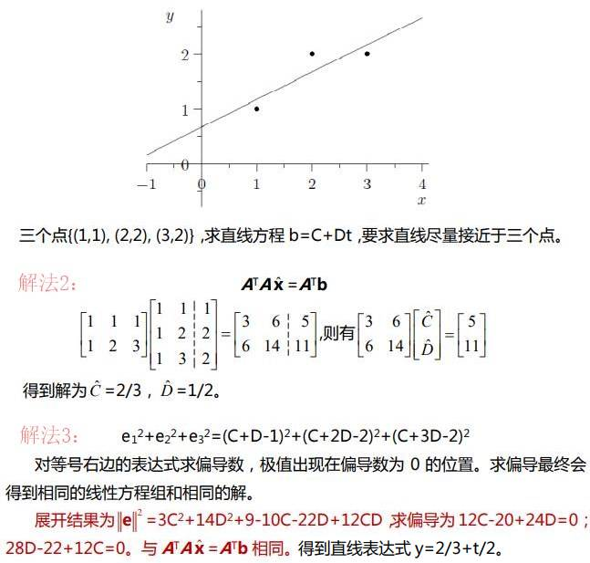

### 线性代数

#### 参考资料
* [数学符号及读法大全](https://blog.csdn.net/qq_37212752/article/details/83956265)

#### 1 introduction to vectors

#### 2 Solving Linear Equations
* [线性代数 - Machine Learning](https://machine-learning-from-scratch.readthedocs.io/zh_CN/latest/%E7%BA%BF%E6%80%A7%E4%BB%A3%E6%95%B0.html)
  * 线性相关：一个向量能被向量组的其他成员线性组合出来；线性无关则不能。
  * 基的定义：向量组中的向量互相线性无关，张成空间V，则它们是空间V的一组基。
  * `选定基之后，向量表示对象，矩阵表示对象的运动，矩阵与向量相乘得到新的向量。一旦理解了这点，线性代数之后的各个主题，包括矩阵乘法、基变换、特征值等都会非常直观易懂。`
  * 旋转矩阵：例如二维矩阵，可以将二维向量按角度旋转，见[二维旋转矩阵与向量旋转](https://zhuanlan.zhihu.com/p/98007510)
  * 变换矩阵：坐标系xyz中的向量v，坐标系XYZ中的向量V，存在变换矩阵R使得`V = R * v`
  * 剪切矩阵：变换矩阵中的一种，例如把正方形往一边挤压，使之成为平行四边形。
* 线性方程组（Ax=b）求解的两种方法：
  * 高斯消元：先得到Ux=b\*，再求解出x
  * LU分解：先由A得到LU，再由Ly=b求解y，再由Ux=y求解x
  * （两者的时间复杂度都是n3，但在A不变的情况下，LU分解的第2、3步只需要n2）
* 求A的逆矩阵：将 \[A I] 逐步消元成 \[I A-1]

#### 3 Vector Spaces and Subspaces
* 子空间：子空间任意两个向量v和w，它们的线性组合仍然在子空间内。
  * 原点是R3的子空间
  * 过原点的直线是R3的子空间
  * 过原点的平面是R3的子空间
* 四个基本子空间：  
  * 列空间：矩阵A的列空间C(A)是其列向量的所有线性组合所构成的空间。
  * 零空间：矩阵A的零空间N(A)是指满足Ax=0的所有解的集合(所有x的集合)。
  * 行空间：矩阵A的行空间C(A)是其行向量的所有线性组合所构成的空间。
  * 左零空间：矩阵AT的零空间，即是矩阵A的左零空间。
  * （对于mxn矩阵，列空间为Rm的子空间，零空间为Rn空间的子空间）
* 求解Ax=0，参考[【线性代数】矩阵的零空间](https://blog.csdn.net/tengweitw/article/details/40039373)
  * A消元成U后，有r个主元列，n-r个自由列
  * U继续消元成新矩阵：|I F0 0|。
  * 零空间（最终的解）：|-FI|。有列交换则要注意还原
  * （A的列空间的维度是r，零空间的维度是n-r）
* 求解Ax=b，假设有r个主元列
  * `r=n=m`：R=I，唯一解
  * `r=n<m`：R=|I0|，唯一解或无解
  * `r=m<n`：R=(I 0)，无穷多解
  * `r<n,r<m`：R=|I F0 0|，无穷多解或无解

#### 4 Orthogonality(正交) 
* 正交向量：若向量x和y正交，则xTy=yTx=0，xy默认是列向量
  * 零向量与所有向量都正交
* 正交子空间：子空间S与子空间T正交，则S中的任意一个向量都和T中的任意向量正交。
  * 0空间和过原点的直线正交；
  * 经过原点的两条直线若夹角为直角则互相正交。
  * 矩阵的行空间的和零空间正交
  * （一个空间中正交子空间的维数之和不可能超过原空间的维数）
* 在R3空间内，A的列空间是一个平面，向量b在此平面的投影是p  
  * 投影矩阵P=A(ATA)-1AT
* 若A的列向量线性无关时，矩阵ATA为可逆矩阵。

* 对于上图的三种求解思路：
  1. 从几何上讨论求解：直线上有三个点p1、p2、p3离原始三个点最近，根据p1、p2、p3来求C、D
  2. 最小二乘法矩阵法：向量b投影到矩阵A的列空间得到向量p，投影到矩阵零空间则是e
  3. 最小二乘法代数法：e12+e22+e32表示三个点最小误差的平方和，[C代码实现](https://shatang.github.io/2020/09/05/%E6%9C%80%E5%B0%8F%E4%BA%8C%E4%B9%98%E6%B3%95/)
  4. 梯度下降法，见[机器学习——最小二乘法](https://www.cnblogs.com/BlairGrowing/p/14847772.html)
* 标准正交矩阵：列向量为标准正交向量
  * 什么是标准正交向量？向量长度都是1，且彼此正交
* 正交矩阵：必须是标准正交矩阵，必须是方阵。(正交矩阵是可逆矩阵)
* 如何推导P=Q(QTQ)-1QT
  * b向量在空间A的投影是p，b-p=e，e垂直于A，存在投影矩阵P使得p=Pb
  * 所以有AT(b-Ax)=0，得到ATAx=ATb
  * 两侧都左乘(ATA)-1，得到x=(ATA)-1ATb
  * p=Ax，所以p=A(ATA)-1ATb
  * p=Pb，所以P=A(ATA)-1AT
* 如何简化P=Q(QTQ)-1QT
  * Q为可逆矩阵：P=QQ-1(QT)-1QT，P=I
  * Q为标准正交矩阵：所以有QTQ=I，进而P=QQT
* 施密特正交化：
  * 三阶矩阵的列向量a、b、c变成标准正交向量A、B、C
  * A = a
  * B = b-xA = b-(ATA)-1ATbA
  * C = c-xA-yB = c-(ATA)-1ATcA-(BTB)-1BTcB
  * 最后ABC除以自身的向量长度得到标准正交向量A、B、C

#### 5 Determinants(行列式)
* 行列式十条性质(只针对方阵)
  1. det(I)=1
  1. 行交换后，行列式会反号
  1. 以二阶方阵为例：
    * a，若某行乘以t则行列式也要乘t
    * b，其中一行不变，另一行可根据加法结合律拆分为两个矩阵
  1. 若存在相同的行，则行列式为0(性质2可推导)
  1. 某行减另一行的t倍，行列式不变(性质3、4可推导)
  1. 某行是零向量，则行列式为0(性质3可推导)
  1. 三角阵的行列式等于对角线数值的乘积(包含上三角和下三角)
  1. 有且仅当矩阵不可逆时，行列式为0
  1. det(AB)=det(A)*det(B)
  1. det(AT)=det(A)
* 行列式公式：∑n!±a1αa2β...anω
  * 表示n阶方阵中，行列式等于n!个矩阵的行列式之和
  * 其中列标号（α, β, ...ω）是列标号（1, 2, ...n）的某个排列
* 代数余子式：det(A)=a11C11+a12C12+...a1nC1n
  * 对于aij而言，Cij就是它的代数余子式
  * Cij表示去掉aij的所在行和列得到的新矩阵的行列式*(-1)i+j
  * （Cij在i+j为偶数时为正，奇数时为负数。）
* 行列式计算的三种方法：
  * 通过消元得到主元，计算简单
  * 通过行列式公式计算，计算复杂
  * 通过代数余子式计算，计算适中
* 如何计算可逆矩阵的逆矩阵
  1. 高斯消元法：将 \[A I] 逐步消元成 \[I A-1]
  1. LU分解法：根据 A=LU 算出 A-1=U-1L-1
  1. QR分解法：根据 A=QR 算出 A-1=R-1Q-1
  1. 代数余子式：A-1=CT/det(A)
* 如何证明A-1=CT/det(A)
  * 两边都左乘A，得到ACT=det(A)I，继续证明这个等式
  * 可以发现ACT对角线都是det(A)，非对角线都是0，所以可证。
* 克莱姆法则：求解Ax=b
  * x=A-1b=CTb/det(A)
  * xj=det(Bj)/det(A)，Bj表示矩阵A的第j列用b代替
  * （克莱姆法则求解效率低，中看不中用）
* det(A)=矩阵A构成的几何体的体积
  * 单位矩阵：不管是几阶矩阵，体积都是1
  * 正交矩阵：边长为1，且边相互垂直，体积都是1

#### 6 Eigenvalues and Eigenvectors(特征值和特征向量) 
* 矩阵的迹：矩阵主对角线元素之和。
* 特征值和特征向量(只针对方阵)
  * 若存在Ax=λx，则λ是特征值，x是特征向量。
  * 任意n阶矩阵有n个特征值(特征值可相同)。
  * 任意n阶矩阵的n个特征值之和等于矩阵的迹。
  * 对称矩阵的特征向量正交。
  * 三角阵的特征值就是对角线上的元素(包含上三角和下三角)
  * 例1：对于投影矩阵P，它的投影平面和垂直于平面的向量都是特征向量
  * 例2：矩阵A|0 11 0|，特征向量是(1 1)和(1 -1)
  * 例3：矩阵A|3 10 3|，特征向量是(1 0)和(1 0)，A是退化矩阵
* 求解特征值和特征向量：先根据det(A-λI)=0求解出λ，再用Ax=λx求解x
  * det(A-λI)=0的论证如下：
  * 由于Ax=λx，可得Ax-λx=0，可得Ax-λIx=0，可得(A-λI)x=0
  * 如果A-λI可逆则x只能是零向量，但很显然x可以是其他向量
  * 所以A-λI不可逆，det(A-λI)=0
* 可对角化：
  * 假设矩阵A的n个特征向量组成S，存在S-1AS=Λ，则表示A可对角化
  * 如果矩阵A可对角化，则A必定存在n个线性无关的特征向量
* 如何证明A=SΛS-1（前提是A是可对角化的）
  * 假设矩阵A的n个特征向量组成S，则AS=A|x1 x2 ... xn|
  * 则有AS=|Ax1 Ax2 ... Axn|
  * 则有AS=|λ1x1 λ2x2 ... λnxn|
  * 则有AS=S|λ1 λ2 ... λn组成的对角阵|
  * 则有AS=SΛ，Λ是由λ1 λ2 ... λn组成的对角阵
  * 两边左乘S-1，得到S-1AS=Λ
  * 两边右乘S-1，得到A=SΛS-1
* 矩阵的幂
  * Ak和A的特征向量相同，特征值是λk
  * 已知A求Ak：Ak=SΛkS-1
* 重特征值
  * A的特征值都不同，则特征向量都线性无关
  * A的特征值有相同，则特征向量不一定线性无关
* 差分方程：假设uk+1=Auk，A是可对角化的
  * 因为A可对角化，则它存在n个线性无关的列向量，它们可以组成S
  * 则有u0=SC，其中由A可以求出S，SC=u0可以求出向量C
  * 则有uk=Aku0=AkSC=SΛkS-1SC
  * 则有uk=SΛkC
  * 则有uk=|λk1x1 λk2x2 ... λknxn|C，[S左乘对角阵Λ，即Λ的对角元素作用于S每一列](image-3.png)
  * 则有uk=c1λk1x1 + c2λk2x2 + ... + cnλknxn
* 斐波那契数列：Fk+2=Fk+1+Fk
  * 假定向量uk=|Fk+2Fk+1|，则uk+1=Auk，其中A=|1 11 0|
  * 则有u0=|10|，uk=Aku0

#### 7 The Singular Value Decomposition(奇异值分解) 
* 第29讲
  1. Image Processing by Linear Algebra(图像处理中的线性代数)
  2. Bases and Matrices in the SVD
  3. Principal Component Analysis(主成分分析)
  4. The Geometry of the SVD(SVD中的几何)

#### 8 Linear Transformations(线性变换) 
* 第30讲
  1. The Idea of a Linear Transformation
  2. The Matrix of a Linear Transformation
  3. The Search for a Good Basis

#### 9 Complex Vectors and Matrices(复向量和矩阵)
* 第26讲
  1. Complex Numbers(复数)
  2. Hermitian and Unitary Matrices(厄米矩阵和酉矩阵)
  3. The Fast Fourier Transform(快速傅里叶变换)

#### 10 Applications(应用)
1. 第31讲 Graphs and Networks(图形和网络)
2. 第26讲 Matrices in Engineering(工程中的矩阵)
3. 第24讲 Markov Matrices, Fourier Series(马尔可夫矩阵、傅立叶级数)

#### 11 Numerical Linear Algebra(数值线性代数) 
1. Gaussian Elimination in Practice
2. Norms and Condition Numbers(标准和条件值)
3. Iterative Methods and Pre conditioners(迭代方法和预条件)

#### 12 Linear Algebra in Probability & Statistics(概率统计中的线性代数)
1. Mean, Variance, and Probability(均值、方差和概率)
2. Covariance Matrices and Joint Probabilities(协方差矩阵与联合概率)
3. Multivariate Gaussian and Weighted Least Squares(多元高斯和加权最小二乘)
