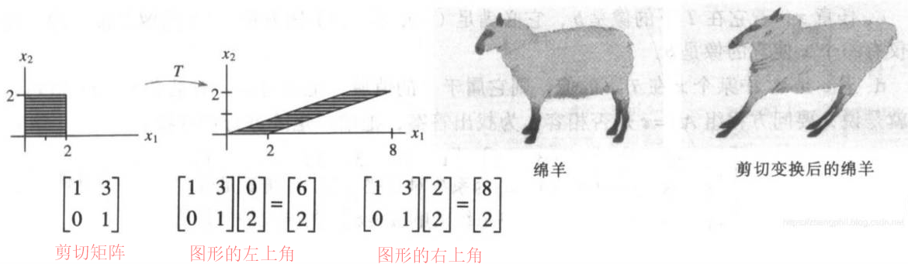

### 线性代数

#### 1 introduction to vectors

列向量：$\begin{vmatrix}1\\2\end{vmatrix}$

$$
\tag{向量与常量的乘法}
\begin{vmatrix}
1\\
9
\end{vmatrix}
*c
=
\begin{vmatrix}
1*c\\
9*c
\end{vmatrix}
$$

$$
\tag{向量与向量的加法}
\begin{vmatrix}
1\\
1
\end{vmatrix}
+
\begin{vmatrix}
2\\
3
\end{vmatrix}
=
\begin{vmatrix}
1+2\\
1+3
\end{vmatrix}
$$

#### 2 Solving Linear Equations

#### 3 Vector Spaces and Subspaces

#### 4 Orthogonality 

#### 5 Determinants 

#### 6 Eigenvalues and Eigenvectors 

#### 7 TheSingularValueDecomposition (SVD) 

#### 8 LinearTransformations 

#### 9 ComplexVectorsand Matrices 

#### 10 Applications 

#### 11 NumericalLinear Algebra 

#### 12 LinearAlgebrain Probability& Statistics 
