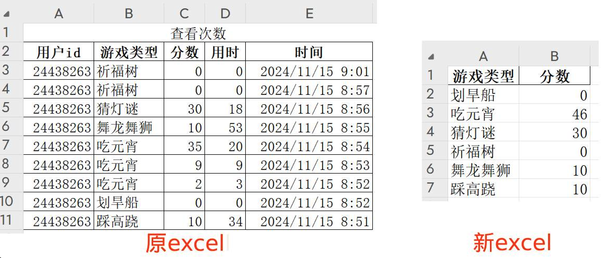

### Python+AI小白教程1：excel的分组统计

#### 背景说明
本文通过一个实际示例演示如何使用Kimi或文心一言生成Python代码来操作Excel并获取所需数据。假设我们有一个Excel文件，我们将利用Python和AI工具，基于Excel的第二列进行分组归类，并对同一分组下的分数进行累加，最终生成一个新的Excel文件。原Excel和新的Excel如下图：



#### 具体步骤
1. 点击[这里](https://static-621585.oss-cn-beijing.aliyuncs.com/python-ai/2025-01-07-example01.rar)下载软件包，解压后里面的input_file.xlsx就是原始excel。
2. 运行starter.exe，出现success则说明环境没有问题。
3. 打开kimi或者文心一言，发送如下内容给AI助手：
 ```
 我有一个Excel，文件名是input_file.xlsx。请帮忙写一个python程序，使用pandas包生成一个新的Excel，文件名是output_file.xlsx。要求如下：
 
 1. Excel有若干列，只保留前3列。
 2. 第2列是游戏类型，第3列是分数，请以游戏类型为分组，累加同类型的分数。
 3. 第1行和第2行是表头，请忽略。
 ```
4. AI助手会提供python代码给你，复制代码然后替换第1步解压的目录里面的index.py的内容。这里提供一份示例代码：
 ```
 import pandas as pd
 df = pd.read_excel('input_file.xlsx', skiprows=2)
 df = df.iloc[:, :3]
 df_grouped = df.groupby(df.columns[1])[df.columns[2]].sum().reset_index()
 df_grouped.to_excel('output_file.xlsx', index=False)
 ```
5. 再次运行starter.exe，如果生成一个output_file.xlsx则说明成功了。打开output_file.xlsx就是最终想要的excel。