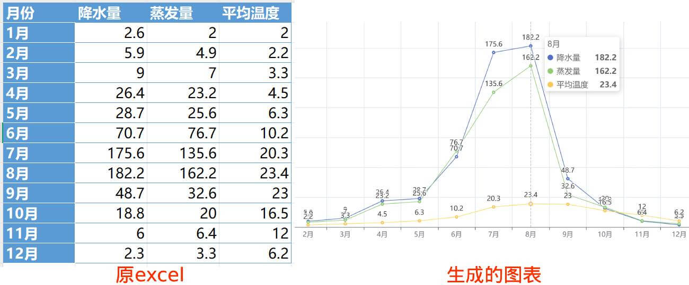

### Python+AI小白教程2：基于excel生成图表

#### 背景说明
本文通过一个实际示例演示如何使用Kimi或文心一言生成Python代码来操作Excel并生成图表。原Excel和图表如下图：



#### 具体步骤
1. 点击[这里](https://static-621585.oss-cn-beijing.aliyuncs.com/python-ai/2025-01-07-example02.rar)下载软件包，解压后里面的input_file.xlsx就是原始excel。
2. 运行starter.exe，出现success则说明环境没有问题。
3. 打开kimi或者文心一言，发送如下内容给AI助手：
 ```
 我有一个Excel，文件名是input_file.xlsx。请写一个python程序，使用pyecharts包生成图表，图表文件名是output_file.html。要求如下：
 
 1. Excel有若干列，第1列是月份，第2列是降水量，第3列是蒸发量，第4列是平均温度。
 2. 第1行是表头，请忽略。
 3. 生成图表，x轴是月份，请展示降水量、蒸发量、平均温度随月份的变化折线图。
 ```
4. AI助手会提供python代码给你，复制代码然后替换第1步解压的目录里面的python_code.txt的内容。这里提供一份示例代码：
 ```
 import pandas as pd
 from pyecharts.charts import Line
 from pyecharts import options as opts
 def generate_chart(input_file, output_file):
     df = pd.read_excel(input_file, skiprows=1)
     months = df.iloc[:, 0].tolist()  # 获取月份
     precipitation = df.iloc[:, 1].tolist()  # 获取降水量
     evaporation = df.iloc[:, 2].tolist()  # 获取蒸发量
     temperature = df.iloc[:, 3].tolist()  # 获取平均温度 
     line = (
         Line()
         .add_xaxis(months)  # 设置x轴为月份
         .add_yaxis("降水量", precipitation)  # 添加降水量折线
         .add_yaxis("蒸发量", evaporation)  # 添加蒸发量折线
         .add_yaxis("平均温度", temperature)  # 添加平均温度折线
         .set_global_opts(
             title_opts=opts.TitleOpts(title="降水量、蒸发量、平均温度变化折线图"),  # 设置图表标题
             tooltip_opts=opts.TooltipOpts(trigger="axis"),  # 鼠标悬停显示数据
             yaxis_opts=opts.AxisOpts(name="数值"),
             xaxis_opts=opts.AxisOpts(name="月份")
         )
     )
     line.render(output_file)
     print(f"图表已保存到 {output_file}")
 input_file = 'input_file.xlsx'  # 输入的Excel文件
 output_file = 'output_file.html'  # 输出的HTML文件
 generate_chart(input_file, output_file)
 ```
5. 再次运行starter.exe，如果生成一个output_file.html则说明成功了。用浏览器打开output_file.html就可以看到生成的图表了。